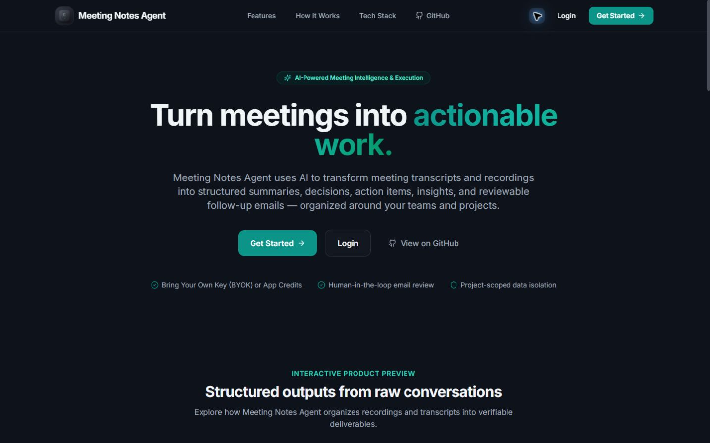
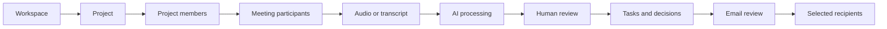

<div align="center">

# Meeting Notes Agent

### Turn every meeting into accountable, reviewable work.

A multi-workspace AI collaboration platform that transforms meeting recordings and transcripts into structured summaries, decisions, insights, tasks, and approved follow-up emails.

[**Open the live application →**](https://meeting-notes-agent-ubaidullah1.vercel.app) · [Explore the architecture](#architecture) · [Run locally](#local-development)


</div>

[](https://meeting-notes-agent-ubaidullah1.vercel.app)

## What it does

Meeting Notes Agent turns raw conversations into a secure, team-scoped workflow:

- Upload audio, upload a transcript, or paste transcript text.
- Generate summaries, decisions, insights, and action items with LangGraph.
- Review and revise AI output before it becomes final.
- Assign structured tasks to project members and track their status.
- Select meeting-specific recipients, review the email, and approve delivery.
- Organize work across multiple isolated teams, projects, and meetings.
- Use personal provider credentials or application credits without exposing secrets.

## Product workflow



Project membership, meeting participation, task assignment, and email recipients are separate relationships. That keeps collaboration flexible without weakening access control.

## Highlights

### Collaborative workspaces

- Create and switch between multiple teams without stale cross-team data.
- Team-scoped Owner, Admin, and Member roles.
- Project membership and participant-restricted meeting access.
- Member dashboards focused on assigned tasks, meetings, projects, and decisions.

### Meeting intelligence

- Draft-first meeting creation with editable metadata and participants.
- Asynchronous transcription and AI processing.
- Structured summaries, decisions, insights, and action items.
- Human approval, revision, rejection, and email-review checkpoints.
- Processing states that remain consistent after refresh.

### Production-minded security

- Backend-enforced team, project, meeting, and task authorization.
- IDOR protection for tenant-scoped resources.
- Platform administration separated from team administration.
- Encrypted user provider credentials with masked API responses.
- Creator-based provider and billing ownership preserved during delegated processing.

## Architecture

| Layer | Technology | Responsibility |
| --- | --- | --- |
| Web application | React 18, TypeScript, Vite, Tailwind CSS | Role-aware workspace, meetings, reviews, tasks, and settings |
| Client data | TanStack React Query, Axios | Team-scoped caching, API requests, and authenticated refresh |
| API | FastAPI, Pydantic | REST endpoints, validation, authentication, and authorization |
| Persistence | SQLAlchemy, PostgreSQL, Alembic | Tenant relationships, transactional data, and schema migrations |
| AI workflow | LangGraph, OpenAI/OpenRouter integrations | Transcription, extraction, summarization, redaction, and task generation |
| Delivery | Mailgun or Resend | Admin-approved meeting follow-up email |
| Hosting | Vercel and Heroku | SPA delivery and API runtime |

```text
User
└── TeamMembership → Team
    └── Project
        ├── ProjectMembership
        └── Meeting
            ├── Participants
            ├── AI results and review state
            ├── Tasks
            └── Email recipients
```

The API is served under `/api/v1`. Authenticated tenant requests carry an `X-Team-ID` header, which is validated against database membership rather than trusted directly.

## Local development

### Prerequisites

- Python 3.13
- [uv](https://docs.astral.sh/uv/)
- Node.js 20+
- PostgreSQL
- FFmpeg for splitting and transcribing longer recordings

### 1. Install the backend

```bash
git clone https://github.com/ubaidull123/Meeting-Notes-Agent.git
cd Meeting-Notes-Agent
uv sync --locked
```

Copy `.env.example` to `.env`, then configure the required local values. At minimum, provide a PostgreSQL `DATABASE_URL`, JWT access and refresh secrets, and a credential-encryption key. Provider and email credentials are optional until those integrations are used.

Never commit `.env` or real credentials.

### 2. Apply database migrations

```bash
uv run alembic upgrade head
uv run alembic current
```

Alembic owns schema evolution. Application startup verifies connectivity but does not replace migration execution.

### 3. Start the API

```bash
uv run uvicorn meeting_notes_agent.api.main:app --reload --port 8000
```

Useful development endpoints:

- API documentation: `http://localhost:8000/docs`
- Health: `http://localhost:8000/health`
- Readiness: `http://localhost:8000/health/ready`

### 4. Start the frontend

```bash
cd frontend
npm ci
npm run dev
```

For local development, create `frontend/.env.local` with this public client configuration:

```dotenv
VITE_API_URL=http://localhost:8000/api/v1
```

Then open `http://localhost:5173`.

## Quality checks

Run the backend suite:

```bash
uv run pytest
```

Run the frontend checks:

```bash
cd frontend
npm run lint
npm run test
npm run build
```

Validate migrations after model changes:

```bash
uv run alembic check
```

The test suite covers authentication, billing, meeting processing, review and email flows, task behavior, PostgreSQL tenancy constraints, cross-team authorization, participant access, and multi-workspace meeting management.

## Project structure

```text
.
├── alembic/                     # Versioned database migrations
├── frontend/                    # React/Vite application
├── src/meeting_notes_agent/
│   ├── api/                     # FastAPI application and routers
│   ├── auth/                    # Authentication dependencies and security
│   ├── database/                # SQLAlchemy models and repositories
│   ├── services/                # Authorization and domain services
│   ├── Nodes/                   # LangGraph processing nodes
│   └── graph.py                 # Meeting-processing workflow
└── tests/                       # Backend, security, and tenancy tests
```

## Deployment

- The React SPA is deployed to Vercel with its API base URL compiled from `VITE_API_URL`.
- The FastAPI service runs on Heroku and exposes liveness/readiness endpoints.
- PostgreSQL schema changes are applied explicitly with `alembic upgrade head`.
- CORS uses exact frontend origins; application secrets remain server-side.

[Launch Meeting Notes Agent](https://meeting-notes-agent-ubaidullah1.vercel.app)

## License

Released under the [MIT License](LICENSE).
