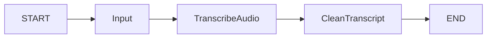
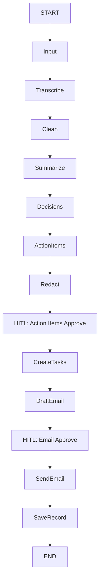

# README Aspiration Gap — Planned vs Implemented

## README's 13-Step Pipeline (from diagram)

| Step | README Description | Implementation Status |
|------|-------------------|----------------------|
| 1 | **Input Validation** | ✅ **Implemented** — `i_Input.py` validates audio/transcript paths |
| 2 | **Transcribe Audio** | ✅ **Implemented** — `ii_transcribe_audio.py` uses Groq Whisper |
| 3 | **Clean Transcript** | ✅ **Implemented** — `iii_clean_transcript.py` uses OpenAI LLM |
| 4 | **Summarize Meeting** | ⚠️ **Orphaned/Broken** — `iv_summerize.py` exists but not in graph, discards all state |
| 5 | **Decisions** | ❌ **Zero code** — No extraction, no node, no model field (only `decisions: List[str]` in state) |
| 6 | **Action Items** | ❌ **Zero code** — No extraction, no node, no model field (only `action_items: List[str]` in state) |
| 7 | **Redact Sensitive Info** | ❌ **Zero code** — No redaction logic, no node |
| 8 | **Action Items Approve (HITL)** | ❌ **Zero code** — No human-in-the-loop checkpoint |
| 9 | **Create Tasks** | ❌ **Zero code** — No Trello/Notion integration, no task client |
| 10 | **Draft Email** | ❌ **Zero code** — No email drafting, no node |
| 11 | **Email Review (HITL)** | ❌ **Zero code** — No email approval checkpoint |
| 12 | **Send Email** | ❌ **Zero code** — No Gmail/SendGrid integration, no email client |
| 13 | **Save Record** | ❌ **Zero code** — No database persistence, empty `postgresdb.py` |

## Current Graph vs README Flow

### Actual Graph (3 nodes)

### README Aspirational Flow (13 steps with HITL checkpoints)

## Missing Integrations (All Zero Implementation)

| Integration | README Mentions | Code Exists |
|-------------|-----------------|-------------|
| **Trello** | Task creation | ❌ No `trello_client.py` |
| **Notion** | Task creation | ❌ No `notion_client.py` |
| **Gmail** | Send email | ❌ No `gmail_client.py` |
| **SendGrid** | Send email | ❌ No `sendgrid_client.py` |
| **SQLite** | `data/meetings.db` | ❌ No database code |
| **PostgreSQL** | Production DB | ❌ Empty `postgresdb.py` |
| **Human-in-the-Loop** | 2 checkpoints | ❌ No interrupt/checkpoint logic |

## Missing Models (Only Stubs in State)

| Model Field | In State | Extraction Logic |
|-------------|----------|------------------|
| `decisions: List[str]` | Yes | ❌ None |
| `action_items: List[str]` | Yes | ❌ None |
| `summary` | Yes | ❌ Broken (orphaned node) |
| `participants` | No (was in commented-out `MeetingDataWithParticipants`) | N/A |

## Missing Infrastructure

| Component | Status |
|-----------|--------|
| CLI entrypoint | ❌ Missing (`meeting_notes_agent:main` doesn't exist) |
| Configuration management | ⚠️ Partial (`.env` empty, `dotenv` used) |
| Logging | ❌ None |
| Error handling | ❌ Minimal (only validators raise) |
| Retry logic | ❌ None |
| Rate limiting | ❌ None |
| Tests | ❌ None |

## Effort Estimate to Reach README Parity

| Area | Estimate |
|------|----------|
| Fix Summarize node + integrate | ~1 day |
| Decisions extraction node | ~1 day |
| Action Items extraction node | ~1 day |
| Redaction node | ~0.5 day |
| HITL checkpoint infrastructure | ~2 days |
| Trello/Notion task clients | ~2 days |
| Email drafting + Gmail/SendGrid clients | ~2 days |
| Database persistence (SQLite + Postgres) | ~2 days |
| CLI with full workflow | ~1 day |
| Tests + CI | ~2 days |
| **Total** | **~14-16 days** |

## Related Pages

- [Graph Composition](/openwiki/architecture/graph.md) — Actual 3-node graph
- [Summarize Node](/openwiki/architecture/nodes/summarize.md) — Broken orphaned node
- [Database](/openwiki/components/database.md) — Empty postgresdb.py
- [LLM Providers](/openwiki/components/llm-providers.md) — Invalid model names blocking steps 3-4
- [Configuration](/openwiki/configuration.md) — Missing CLI entrypoint
- [Testing](/openwiki/testing.md) — No tests for any step