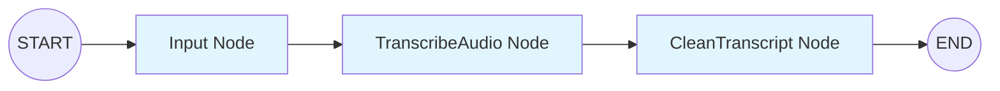
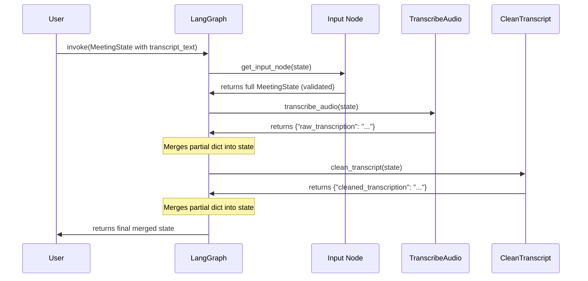
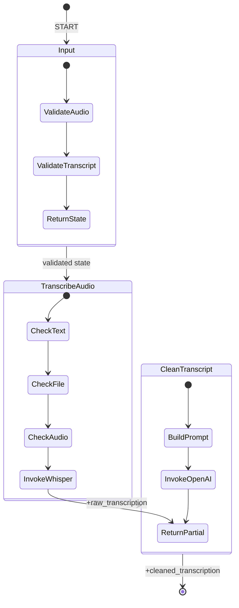

# Graph Composition — LangGraph StateGraph with 3 Working Nodes

## Current Graph Implementation

**Source**: `src/graph.py`

```python
from langgraph.graph import StateGraph, START, END
from src.state_schema import MeetingState
from src.Nodes.i_Input import get_input_node
from src.Nodes.ii_transcribe_audio import transcribe_audio
from src.Nodes.iii_clean_transcript import clean_transcript


def build_graph() -> StateGraph:
    """Build and return the meeting notes agent graph."""
    graph = StateGraph(MeetingState)

    graph.add_node("Input", get_input_node)
    graph.add_node("TranscribeAudio", transcribe_audio)
    graph.add_node("CleanTranscript", clean_transcript)

    graph.add_edge(START, "Input")
    graph.add_edge("Input", "TranscribeAudio")
    graph.add_edge("TranscribeAudio", "CleanTranscript")
    graph.add_edge("CleanTranscript", END)

    return graph


graph = build_graph()


if __name__ == "__main__":
    # Quick test compile
    app = graph.compile()
    print("Graph compiled successfully")
    print("Nodes:", list(app.get_graph().nodes.keys()))
```

## Graph Structure



### Nodes (3 Working)

| Node ID | Function | Source File | Return Type |
|---------|----------|-------------|-------------|
| `Input` | `get_input_node` | `i_Input.py` | `MeetingState` (full) |
| `TranscribeAudio` | `transcribe_audio` | `ii_transcribe_audio.py` | `dict` (partial) |
| `CleanTranscript` | `clean_transcript` | `iii_clean_transcript.py` | `dict` (partial) |

### Edges (4 Edges — Fully Connected)

| From | To | Type |
|------|-----|------|
| `START` | `Input` | Entry |
| `Input` | `TranscribeAudio` | Sequential |
| `TranscribeAudio` | `CleanTranscript` | Sequential |
| `CleanTranscript` | `END` | Terminal |

## Compilation

The graph **compiles successfully**:

```bash
python -m meeting_notes_agent.src.graph
# Output:
# Graph compiled successfully
# Nodes: ['Input', 'TranscribeAudio', 'CleanTranscript', '__start__', '__end__']
```

### Compiled App Usage

```python
from meeting_notes_agent.src.graph import graph
from meeting_notes_agent.src.state_schema import MeetingState, Attendee
from datetime import date

app = graph.compile()

initial_state = MeetingState(
    meeting_title="Team Sync",
    meeting_date=date.today(),
    transcript_text="Speaker 1: Hello um world",
    attendees=[Attendee(name="Alice", email="alice@example.com")]
)

result = app.invoke(initial_state)
# result contains: meeting_id, meeting_title, ..., raw_transcription, cleaned_transcription
```

## Missing: Summarize Node

**File exists**: `src/Nodes/iv_summerize.py` (misspelled "summerize")

**Not imported, not added to graph, not connected.**

```python
# NOT in graph.py:
# from src.Nodes.iv_summerize import summerize_meeting_notes
# graph.add_node("Summarize", summerize_meeting_transcript)
# graph.add_edge("CleanTranscript", "Summarize")
# graph.add_edge("Summarize", END)
```

### Why It's Not Integrated

1. **Broken implementation** — Returns `MeetingState` with ONLY `summary` field, discarding all pipeline state
2. **Wrong function name** — `summerize_meeting_notes` (misspelled)
3. **Invalid model** — Uses `get_openai_llm()` with `model="gpt-5.6-luna"` (non-existent)

See [Summarize Node](/openwiki/architecture/nodes/summarize.md) for details.

## Historical: Broken Graph State (Fixed)

The previous version of `graph.py` had:
- Wrong state type: `StateGraph(MeetingInput)` — `MeetingInput` was commented-out class
- Only 2 nodes: Input, TranscribeAudio
- Missing CleanTranscript node
- No edges
- No `.compile()`
- Import-time failure

**Current version fixes all of the above.**

## State Merging Behavior



### Merge Semantics

| Node | Return | Merge Behavior |
|------|--------|----------------|
| Input | `MeetingState` | Full replacement (all fields from returned object) |
| TranscribeAudio | `dict` | Partial merge (only `raw_transcription` updated) |
| CleanTranscript | `dict` | Partial merge (only `cleaned_transcription` updated) |

**Warning**: Input node returning full `MeetingState` works but is unconventional. Typical LangGraph nodes return partial `dict`.

## Graph Visualization (Mermaid State Diagram)



## Running the Graph

### Programmatic (Current Only Way)

```python
from meeting_notes_agent.src.graph import graph
from meeting_notes_agent.src.state_schema import MeetingState, Attendee
from datetime import date

app = graph.compile()

# Option 1: Audio file (requires Groq API key + fixed model name)
state = MeetingState(
    meeting_title="Meeting",
    meeting_date=date.today(),
    audio_file_path="recording.mp3"
)

# Option 2: Transcript file
state = MeetingState(
    meeting_title="Meeting",
    meeting_date=date.today(),
    transcript_file_path="transcript.txt"
)

# Option 3: Direct transcript text
state = MeetingState(
    meeting_title="Meeting",
    meeting_date=date.today(),
    transcript_text="Speaker 1: Hello world"
)

result = app.invoke(state)
```

### CLI (Missing)

<!-- openwiki: broken internal link [/openwiki/configuration.md#missing-entrypoint] heading anchor "missing-entrypoint" does not exist in "/openwiki/configuration.md". Fix the href or restore the target, then delete this comment. -->
No CLI entrypoint exists. See [Configuration](/openwiki/configuration.md#missing-entrypoint).

## Adding Nodes (Extension Pattern)

To add a new node (e.g., Summarize):

```python
# 1. Create node function returning partial dict
def summarize_meeting(state: MeetingState) -> dict:
    # ... LLM call ...
    return {"summary": result.content}

# 2. Add to graph.py
from src.Nodes.v_summarize import summarize_meeting

def build_graph() -> StateGraph:
    graph = StateGraph(MeetingState)
    # ... existing nodes ...
    graph.add_node("Summarize", summarize_meeting)
    graph.add_edge("CleanTranscript", "Summarize")
    graph.add_edge("Summarize", END)
    return graph
```

## Related Pages

- [Architecture Overview](/openwiki/architecture/overview.md) — High-level pipeline
- [State Schema](/openwiki/architecture/state-schema.md) — MeetingState, type conflicts
- [Input Node](/openwiki/architecture/nodes/input.md) — Validation node
- [Transcribe Node](/openwiki/architecture/nodes/transcribe.md) — Transcription node
- [Clean Node](/openwiki/architecture/nodes/clean.md) — Cleaning node
- [Summarize Node](/openwiki/architecture/nodes/summarize.md) — Missing/broken node
- [Configuration](/openwiki/configuration.md) — Running without CLI
- [README Aspiration Gap](/openwiki/README-aspiration.md) — 13-step plan vs 3 nodes