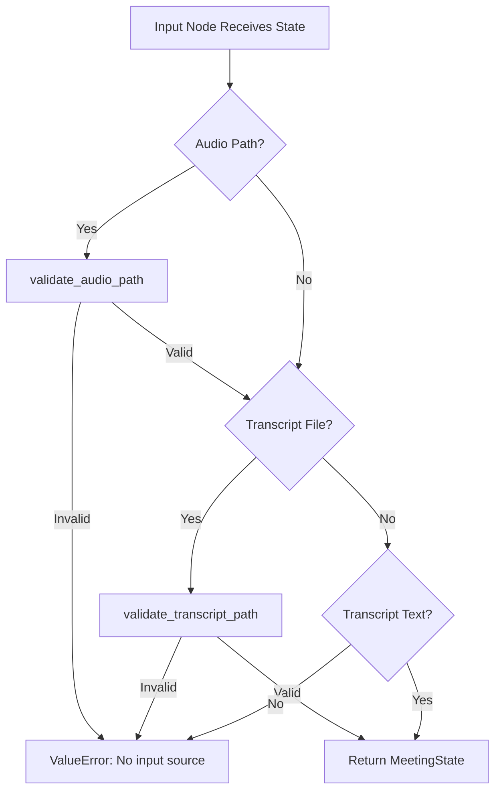

# Input Node — Validation & Normalization

## Source

**File**: `src/Nodes/i_Input.py`

```python
from src.state_schema import MeetingState, validate_audio_path, validate_transcript_path


def get_input_node(state: MeetingState) -> MeetingState:
    """
    Input node: validates input and normalizes the initial state.
    Returns partial dict for LangGraph to merge.
    """
    # Validate audio path if provided
    if state.audio_file_path:
        validate_audio_path(state.audio_file_path)

    # Validate transcript file path if provided
    if state.transcript_file_path:
        validate_transcript_path(state.transcript_file_path)

    # If transcript_text provided but no file path, that's fine
    # If audio provided, transcription will happen in next node

    return state
```

## Responsibilities

| Responsibility | Implementation |
|----------------|----------------|
| Validate audio file extension | `validate_audio_path()` — checks `.mp3`, `.wav`, `.m4a` |
| Validate transcript file extension | `validate_transcript_path()` — checks `.txt`, `.md`, `.text`, `.transcript` |
| Accept transcript_text directly | No validation needed (already text) |
| Normalize state | Returns state unchanged (validation side-effect only) |

## Validation Flow



## Return Type: Full MeetingState (Unconventional)

```python
return state  # Returns MeetingState instance, NOT partial dict
```

**LangGraph convention**: Nodes should return partial `dict` for state merging.

**Impact**: 
- Works because all fields are preserved (validation doesn't modify)
- But replaces entire state object on each merge
- If node modified state, partial updates from previous nodes would be lost

**Recommended fix**:
```python
def get_input_node(state: MeetingState) -> dict:
    if state.audio_file_path:
        validate_audio_path(state.audio_file_path)
    if state.transcript_file_path:
        validate_transcript_path(state.transcript_file_path)
    return {}  # No state changes needed, validation is side-effect
```

## Integration in Graph

**File**: `src/graph.py`

```python
graph.add_node("Input", get_input_node)
graph.add_edge(START, "Input")
graph.add_edge("Input", "TranscribeAudio")
```

Position: **First node** after START, before TranscribeAudio.

## Input Sources Handled

| Source | Field | Validation | Next Step |
|--------|-------|------------|-----------|
| Audio file | `audio_file_path` | `validate_audio_path` → checks extension | TranscribeAudio uses Groq Whisper |
| Transcript file | `transcript_file_path` | `validate_transcript_path` → checks extension | TranscribeAudio reads file |
| Direct text | `transcript_text` | None (already text) | TranscribeAudio uses directly |

## Error Cases

| Error | Cause | Message |
|-------|-------|---------|
| `ValueError` | Audio extension not in {`.mp3`, `.wav`, `.m4a`} | "Unsupported audio format. Supported formats: MP3, WAV, M4A" |
| `ValueError` | Transcript extension not in {`.txt`, `.md`, `.text`, `.transcript`} | "Unsupported transcript format. Use TXT, MD, or a text transcript file." |
| `ValueError` | No input source at all | From `MeetingState` model validator: "Must provide at least one of: audio_file_path, transcript_file_path, or transcript_text" |

## Validators Used

From `src.state_schema`:
- `validate_audio_path(path: str) -> str`
- `validate_transcript_path(path: str) -> str`
- Constants: `AUDIO_EXTENSIONS`, `TRANSCRIPT_EXTENSIONS` (frozensets)

See [Validation](/openwiki/components/validation.md) for duplication with `audio.py`.

## Testing (Manual)

```python
from meeting_notes_agent.src.Nodes.i_Input import get_input_node
from meeting_notes_agent.src.state_schema import MeetingState, Attendee
from datetime import date

# Valid audio
state = MeetingState(
    meeting_title="Test",
    meeting_date=date.today(),
    audio_file_path="test.mp3"
)
result = get_input_node(state)  # Returns same state

# Invalid audio
state = MeetingState(
    meeting_title="Test",
    meeting_date=date.today(),
    audio_file_path="test.txt"
)
get_input_node(state)  # Raises ValueError

# Transcript text (no validation)
state = MeetingState(
    meeting_title="Test",
    meeting_date=date.today(),
    transcript_text="Hello world"
)
result = get_input_node(state)  # Returns same state
```

## Related Pages

- [Graph Composition](/openwiki/architecture/graph.md) — Input node in pipeline
- [State Schema](/openwiki/architecture/state-schema.md) — MeetingState, validators
- [Validation](/openwiki/components/validation.md) — Validators, duplication
- [Transcribe Node](/openwiki/architecture/nodes/transcribe.md) — Next node in pipeline
- [Architecture Overview](/openwiki/architecture/overview.md) — Full pipeline