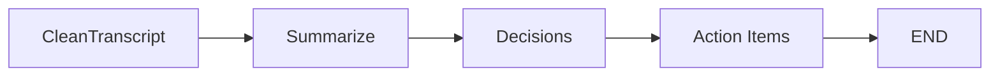

# Summarize Node — Broken, Orphaned, Data Loss Bug

## Source

**File**: `src/Nodes/iv_summerize.py` (note: misspelled "summerize")

```python
from src.state_schema import MeetingState
from src.llms.API_Based.openai import get_openai_llm


def summerize_meeting_notes(state: MeetingState) -> MeetingState:
    """
    Summarizes the meeting notes.
    """
    llm = get_openai_llm()
    
    # Creates NEW MeetingState with ONLY 2 fields - LOSES ALL OTHER STATE
    meeting_data = MeetingState(
        cleaned_transcription=state.cleaned_transcription,
        summary=""  # Empty initially
    )
    
    # Invoke LLM with cleaned transcription
    messages = [
        ("system", "Summarize the meeting transcript in 3-5 sentences."),
        ("human", meeting_data.cleaned_transcription)
    ]
    result = llm.invoke(messages)
    
    # Creates ANOTHER new MeetingState with ONLY summary field - CATASTROPHIC DATA LOSS
    return MeetingState(summary=result.content)


if __name__ == "__main__":
    # Test with sample
    test_state = MeetingState(
        meeting_title="Test Meeting",
        meeting_date=date.today(),
        cleaned_transcription="Speaker 1: We discussed the project timeline."
    )
    result = summerize_meeting_notes(test_state)
    print(f"Summary: {result.summary}")
```

## Critical Bugs

### 1. Misspelled Function Name
```python
def summerize_meeting_notes(...)  # "summerize" vs "summarize"
```

### 2. Invalid Model Name
Uses `get_openai_llm()` which has `model="gpt-5.6-luna"` (non-existent).

### 3. Catastrophic Data Loss — First State Creation

```python
meeting_data = MeetingState(
    cleaned_transcription=state.cleaned_transcription,
    summary=""  # Only 2 fields set!
)
```

**Lost fields**: `meeting_id`, `meeting_title`, `meeting_date`, `meeting_time`, `project_name`, `audio_file_path`, `transcript_file_path`, `transcript_text`, `attendees`, `agenda`, `notes`, `raw_transcription`, `decisions`, `action_items`

### 4. Catastrophic Data Loss — Return Value

```python
return MeetingState(summary=result.content)
```

**Returns ONLY `summary` field**. All other fields get default values (empty strings, empty lists, None, new UUID).

### 5. Wrong Return Type for LangGraph

Returns full `MeetingState` instead of partial `dict`. In a LangGraph pipeline, this would replace the entire accumulated state with just the summary.

## Data Loss Visualization

```mermaid
flowchart LR
    InputState[Full MeetingState\n20+ fields] -->|Passed to| SummarizeNode[summerize_meeting_notes]
    SummarizeNode -->|Creates| PartialState1[MeetingState\nONLY: cleaned_transcription, summary=""]
    PartialState1 -->|LLM Call| LLM[OpenAI LLM]
    LLM -->|Creates| PartialState2[MeetingState\nONLY: summary="LLM output"]
    PartialState2 -.->|Returns| OutputState[Final State\nONLY summary preserved\nALL OTHER FIELDS LOST]
    
    style PartialState1 fill:#ffcdd2
    style PartialState2 fill:#ffcdd2
    style OutputState fill:#ffcdd2
```

## What Should Happen (Correct Pattern)

```python
def summarize_meeting(state: MeetingState) -> dict:
    """
    Correct pattern: return partial dict for LangGraph merging.
    """
    llm = get_openai_llm()  # With fixed model name
    
    transcript = state.cleaned_transcription or state.raw_transcription or ""
    if not transcript.strip():
        return {"summary": ""}
    
    messages = [
        ("system", "Summarize the meeting transcript in 3-5 sentences."),
        ("human", transcript)
    ]
    result = llm.invoke(messages)
    
    return {"summary": result.content}  # Partial update - preserves all other state!
```

## Integration Status: NOT IN GRAPH

**File**: `src/graph.py` — **does not import or add this node**

```python
# MISSING from graph.py:
# from src.Nodes.iv_summerize import summerize_meeting_notes
# graph.add_node("Summarize", summerize_meeting_notes)
# graph.add_edge("CleanTranscript", "Summarize")
# graph.add_edge("Summarize", END)
```

## Required Fixes to Make Usable

| Fix | Priority |
|-----|----------|
| Rename function to `summarize_meeting` | High |
| Change return type to `dict` (partial) | Critical |
| Preserve all state fields in processing | Critical |
| Fix model name in `openai.py` (`gpt-5.6-luna` → `gpt-4o-mini`) | Critical |
| Add to `graph.py` with proper edges | High |
| Add error handling | Medium |
| Add tests | Medium |

## If Integrated (Hypothetical Graph)



## Related Pages

- [Graph Composition](/openwiki/architecture/graph.md) — Current 3-node graph (Summarize absent)
- [Clean Node](/openwiki/architecture/nodes/clean.md) — Would precede Summarize
- [LLM Providers](/openwiki/components/llm-providers.md) — OpenAI invalid model
- [State Schema](/openwiki/architecture/state-schema.md) — MeetingState, type conflicts
- [README Aspiration Gap](/openwiki/README-aspiration.md) — Step 4 of 13
- [Configuration](/openwiki/configuration.md) — API key needed