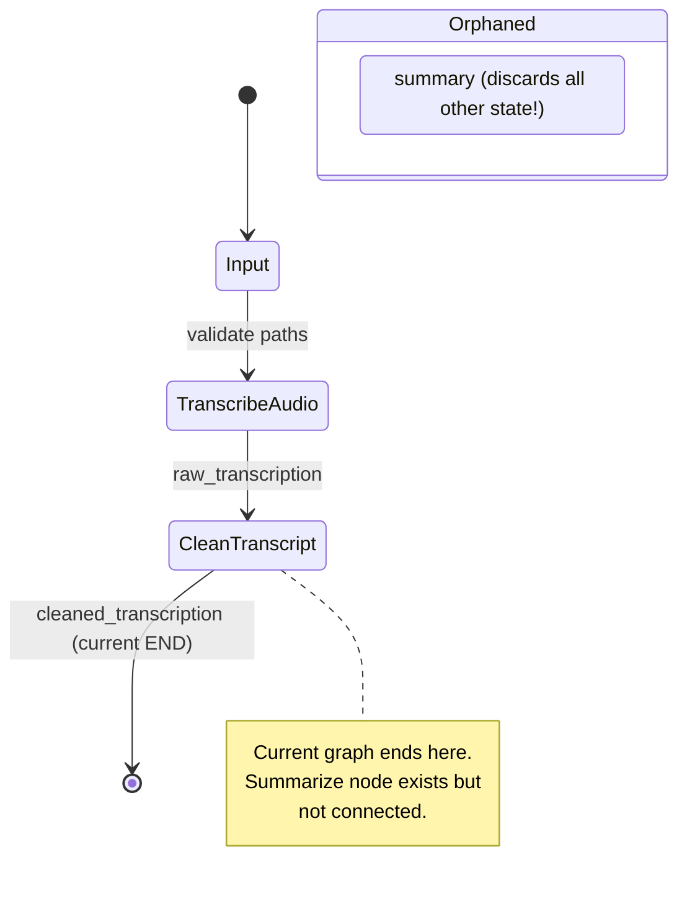

# System Architecture — Meeting Notes Agent Pipeline

## High-Level Architecture

<!-- openwiki: mermaid parse failed and this diagram was converted to a text fence so it does not break rendering. Fix the diagram source and restore the mermaid fence. Parser error: Heuristic: an unescaped angle bracket inside a label breaks rendering; rephrase the label. -->
```text
flowchart TD
    subgraph "Runtime"
        CLI[CLI Entrypoint MISSING]
    end

    subgraph "LangGraph Pipeline (3 Working Nodes)"
        START((START))
        Input[Input Node<br/>Validation & Normalization]
        Transcribe[TranscribeAudio Node<br/>Groq Whisper]
        Clean[CleanTranscript Node<br/>OpenAI LLM]
        END((END))
    end

    subgraph "Orphaned (Not in Graph)"
        Summarize[Summarize Node<br/>BROKEN - Data Loss]
    end

    subgraph "External Services"
        Groq[Groq API<br/>Whisper]
        OpenAI[OpenAI API<br/>GPT-4o etc.]
        HF[HuggingFace<br/>Local Whisper UNUSED]
    end

    subgraph "State"
        State[MeetingState<br/>Pydantic Model]
    end

    CLI -.->|meeting_notes_agent:main (does not exist)| START
    START --> Input
    Input --> Transcribe
    Transcribe --> Clean
    Clean --> END
    
    Input -.->|validates| State
    Transcribe -.->|reads/writes| State
    Clean -.->|reads/writes| State
    
    Transcribe --> Groq
    Clean --> OpenAI
    Summarize -.-> OpenAI
    HF -.->|eager load at import| HF
```

## Component Map

| Layer | Components | Status |
|-------|------------|--------|
| **Entrypoint** | CLI (`meeting_notes_agent:main`) | ❌ Missing |
| **Orchestration** | LangGraph `StateGraph` | ✅ Working (3 nodes) |
| **State** | `MeetingState` (Pydantic) | ✅ Canonical |
| **Nodes** | Input, TranscribeAudio, CleanTranscript | ✅ Working |
| **Nodes** | Summarize | ⚠️ Orphaned, broken |
| **LLM Providers** | Groq, OpenAI, OpenRouter, HF Whisper | ⚠️ Invalid models, HF eager load |
| **Persistence** | PostgresCheckpoint | ❌ Empty file |
| **Integrations** | Trello, Notion, Gmail, SendGrid | ❌ Zero code |

## Data Flow

```
User Input (audio file or transcript)
        │
        ▼
┌───────────────────┐
│  MeetingState     │ ◄─── Validation (audio path, transcript path, at least one source)
│  Construction     │
└─────────┬─────────┘
          │
          ▼
┌───────────────────┐
│  Input Node       │ ──► Validates paths, normalizes state
│  (get_input_node) │
└─────────┬─────────┘
          │
          ▼
┌───────────────────┐
│  TranscribeAudio  │ ──► If audio: Groq Whisper → raw_transcription
│  (transcribe_audio)│     If transcript file: read file → raw_transcription
└─────────┬─────────┘     If transcript_text: use directly → raw_transcription
          │
          ▼
┌───────────────────┐
│  CleanTranscript  │ ──► OpenAI LLM cleans raw_transcription
│  (clean_transcript)│    → cleaned_transcription
└─────────┬─────────┘
          │
          ▼
        END (Current graph stops here)
          │
          ▼ (Not implemented)
┌───────────────────┐
│  Summarize        │ Would consume cleaned_transcription → summary
│  (broken)         │
└─────────┬─────────┘
          │
          ▼ (Not implemented)
┌───────────────────┐
│  Decisions /      │ Would extract structured data
│  Action Items     │
└─────────┬─────────┘
          │
          ▼ (Not implemented)
┌───────────────────┐
│  HITL Checkpoints │ Human review/approval
│  Redaction        │
│  Task Creation    │ Trello/Notion
│  Email Draft/Send │ Gmail/SendGrid
│  Save Record      │ Database
└───────────────────┘
```

## State Machine (LangGraph)



## Key Invariants

| Invariant | Enforcement |
|-----------|-------------|
| At least one input source (audio/transcript) | `MeetingState` model validator + Input node |
| Audio format ∈ {MP3, WAV, M4A} | `validate_audio_path` (frozenset) |
| Transcript format ∈ {TXT, MD, text, transcript} | `validate_transcript_path` (frozenset) |
| State merges correctly | Nodes return partial `dict` (except Input returns full `MeetingState`) |
| Graph compiles | `graph.compile()` in `__main__` |

## Current Limitations (Blocking Execution)

1. **No CLI entrypoint** — Cannot run as command
2. **Invalid model names** — OpenAI `gpt-5.6-luna` doesn't exist; Groq empty string
3. **Empty `.env`** — No API keys configured
4. **HF Whisper eager load** — Importing local module triggers heavy computation
5. **No tests** — No verification possible
6. **Summarize not integrated** — Pipeline incomplete

## Related Pages

- [Graph Composition](/openwiki/architecture/graph.md) — LangGraph StateGraph details
- [State Schema](/openwiki/architecture/state-schema.md) — MeetingState, Attendee, validators
- [Input Node](/openwiki/architecture/nodes/input.md) — Validation, normalization
- [Transcribe Node](/openwiki/architecture/nodes/transcribe.md) — Groq Whisper transcription
- [Clean Node](/openwiki/architecture/nodes/clean.md) — OpenAI LLM cleaning
- [Summarize Node](/openwiki/architecture/nodes/summarize.md) — Orphaned, broken
- [LLM Providers](/openwiki/components/llm-providers.md) — All provider factories, issues
- [Configuration](/openwiki/configuration.md) — Environment, packaging, entrypoint
- [README Aspiration Gap](/openwiki/README-aspiration.md) — 13-step plan vs 3-node reality