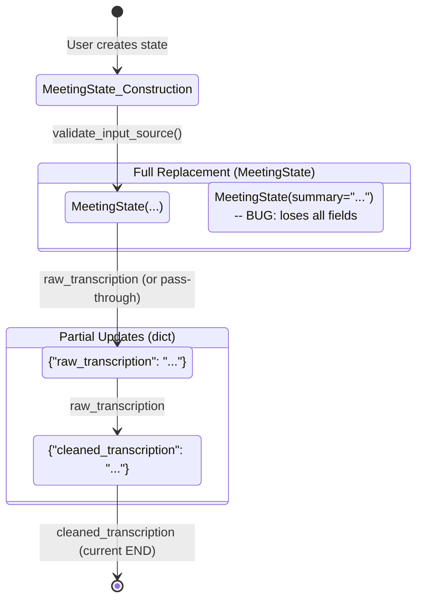

# State Schema — MeetingState, Attendee, Validators, Type Conflicts

## Canonical State: `MeetingState`

**Source**: `src/state_schema.py`

```python
class MeetingState(BaseModel):
    """
    Universal state for the meeting notes pipeline.
    All fields have defaults so LangGraph nodes can return partial updates.
    """
    # Identification & metadata
    meeting_id: str = Field(default_factory=lambda: str(uuid.uuid4()))
    meeting_title: str = Field(default="", min_length=0)
    meeting_date: date = Field(default_factory=lambda: date.today())
    meeting_time: Optional[str] = None
    project_name: Optional[str] = None

    # Input sources (at least one must be provided initially)
    audio_file_path: Optional[str] = None
    transcript_file_path: Optional[str] = None
    transcript_text: Optional[str] = None

    # Attendees & agenda
    attendees: List[Attendee] = Field(default_factory=list)
    agenda: List[str] = Field(default_factory=list)
    notes: Optional[str] = None

    # Pipeline outputs
    raw_transcription: Optional[str] = None
    cleaned_transcription: Optional[str] = None
    summary: Optional[str] = None
    decisions: List[str] = Field(default_factory=list)
    action_items: List[str] = Field(default_factory=list)

    @model_validator(mode="after")
    def validate_input_source(self) -> "MeetingState":
        """Ensure at least one transcript/audio source is provided at entry."""
        has_audio = bool(self.audio_file_path)
        has_transcript_file = bool(self.transcript_file_path)
        has_transcript_text = bool(self.transcript_text)
        if not (has_audio or has_transcript_file or has_transcript_text):
            raise ValueError(
                "Must provide at least one of: audio_file_path, transcript_file_path, or transcript_text"
            )
        return self

    def to_input_dict(self) -> dict:
        """Extract only the input fields for backward compatibility."""
        return {
            "meeting_title": self.meeting_title,
            "meeting_date": self.meeting_date,
            "audio_file_path": self.audio_file_path,
            "transcript_file_path": self.transcript_file_path,
            "transcript_text": self.transcript_text,
            "attendees": self.attendees,
            "project_name": self.project_name,
            "meeting_time": self.meeting_time,
            "agenda": self.agenda,
            "notes": self.notes,
        }
```

### Field Categories

| Category | Fields |
|----------|--------|
| **Identification** | `meeting_id`, `meeting_title`, `meeting_date`, `meeting_time`, `project_name` |
| **Input Sources** | `audio_file_path`, `transcript_file_path`, `transcript_text` |
| **People/Planning** | `attendees`, `agenda`, `notes` |
| **Pipeline Outputs** | `raw_transcription`, `cleaned_transcription`, `summary`, `decisions`, `action_items` |

### Model Validator

The `validate_input_source` validator runs at **construction time** (before graph execution) and ensures at least one input source is provided.

## Attendee Sub-Model

```python
class Attendee(BaseModel):
    """Represents a meeting attendee with name and email."""
    name: str = Field(..., min_length=1, description="Full name of the attendee")
    email: str = Field(..., min_length=3, description="Email address of the attendee")
```

Used in `MeetingState.attendees: List[Attendee]`.

## Validators (Audio/Transcript Paths)

**Source**: `src/state_schema.py` lines 74-92

```python
AUDIO_EXTENSIONS: frozenset[str] = frozenset({".mp3", ".wav", ".m4a"})
TRANSCRIPT_EXTENSIONS: frozenset[str] = frozenset({".txt", ".md", ".text", ".transcript"})


def validate_audio_path(path: str) -> str:
    """Validate audio file extension."""
    from pathlib import Path
    if Path(path).suffix.lower() not in AUDIO_EXTENSIONS:
        raise ValueError("Unsupported audio format. Supported formats: MP3, WAV, M4A")
    return path


def validate_transcript_path(path: str) -> str:
    """Validate transcript file extension."""
    from pathlib import Path
    if Path(path).suffix.lower() not in TRANSCRIPT_EXTENSIONS:
        raise ValueError("Unsupported transcript format. Use TXT, MD, or a text transcript file.")
    return path
```

**Note**: These are duplicated in `src/data/input/audio.py` with misleading "single source of truth" comment. See [Validation](/openwiki/components/validation.md).

## AudioFormat — Dynamic Type

```python
# Backward-compat re-exports
AudioFormat = type("AudioFormat", (), {ext[1:].upper(): ext for ext in AUDIO_EXTENSIONS})
# Creates: AudioFormat.MP3 == ".mp3", AudioFormat.WAV == ".wav", AudioFormat.M4A == ".m4a"
```

**Not an Enum** — dynamically created class. Validators use `AUDIO_EXTENSIONS` frozenset directly.

## Type System Conflicts

### 1. Pydantic Model vs Partial Dict Returns

| Node | Return Type | Merges Correctly? |
|------|-------------|-------------------|
| `Input` (`get_input_node`) | `MeetingState` (full object) | ⚠️ Replaces entire state |
| `TranscribeAudio` (`transcribe_audio`) | `dict` (partial: `{"raw_transcription": ...}`) | ✅ Yes |
| `CleanTranscript` (`clean_transcript`) | `dict` (partial: `{"cleaned_transcription": ...}`) | ✅ Yes |
| `Summarize` (orphaned) | `MeetingState` (full but **incomplete**) | ❌ Would lose all other fields |

**LangGraph expects** partial `dict` returns for state merging. The `Input` node returning full `MeetingState` works but replaces state. The `Summarize` node returning incomplete `MeetingState` would cause catastrophic data loss.

### 2. MeetingInput vs MeetingState

| Aspect | Detail |
|--------|--------|
| **Historical** | `MeetingInput` was separate Pydantic model in commented-out `meeting_data.py` |
| **Current** | `MeetingInput = MeetingState` (alias in `meeting_data.py` shim) |
| **Graph** | Uses `StateGraph(MeetingState)` — correct |
| **Conflict** | None currently, but historical confusion exists |

### 3. AudioFormat: Dynamic Type vs Enum

| | Runtime (Actual) | Aspirational (Removed) |
|--|------------------|------------------------|
| **Type** | `type("AudioFormat", ..., {})` | `class AudioFormat(str, Enum)` |
| **MP3** | `".mp3"` | `"mp3"` |
| **Used by validators** | No (uses frozenset) | Would be if existed |

## Graph State Type

**File**: `src/graph.py`

```python
from src.state_schema import MeetingState
from langgraph.graph import StateGraph

graph = StateGraph(MeetingState)  # Correct: uses MeetingState
```

## State Transition Diagram



## Usage in Nodes

### Input Node (`i_Input.py`)
```python
def get_input_node(state: MeetingState) -> MeetingState:
    if state.audio_file_path:
        validate_audio_path(state.audio_file_path)
    if state.transcript_file_path:
        validate_transcript_path(state.transcript_file_path)
    return state  # Returns FULL MeetingState
```

### TranscribeAudio Node (`ii_transcribe_audio.py`)
```python
def transcribe_audio(state: MeetingState) -> dict:
    if state.transcript_text:
        return {"raw_transcription": state.transcript_text}
    if state.transcript_file_path:
        with open(state.transcript_file_path) as f:
            return {"raw_transcription": f.read()}
    if state.audio_file_path:
        transcription = llm.invoke(state.audio_file_path)
        return {"raw_transcription": transcription}  # Returns PARTIAL dict
    return {"raw_transcription": ""}
```

### CleanTranscript Node (`iii_clean_transcript.py`)
```python
def clean_transcript(state: MeetingState) -> dict:
    # ... LLM call ...
    return {"cleaned_transcription": result.content}  # Returns PARTIAL dict
```

## Related Pages

- [Graph Composition](/openwiki/architecture/graph.md) — StateGraph with MeetingState
- [Input Node](/openwiki/architecture/nodes/input.md) — Validation, returns full state
- [Transcribe Node](/openwiki/architecture/nodes/transcribe.md) — Returns partial dict
- [Clean Node](/openwiki/architecture/nodes/clean.md) — Returns partial dict
- [Summarize Node](/openwiki/architecture/nodes/summarize.md) — Returns broken full state
- [Validation](/openwiki/components/validation.md) — Validators in state_schema vs audio.py
- [Data Models](/openwiki/components/data-models.md) — MeetingInput alias, AudioFormat conflict