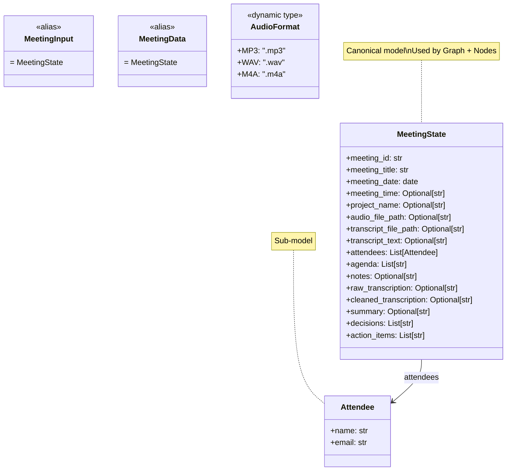

# Data Models — MeetingState, MeetingInput, MeetingData, Attendee, AudioFormat

## Canonical Model: MeetingState

**Source**: `src/state_schema.py` — **single source of truth**

```python
class MeetingState(BaseModel):
    """
    Universal state for the meeting notes pipeline.
    All fields have defaults so LangGraph nodes can return partial updates.
    """
    # Identification & metadata
    meeting_id: str = Field(default_factory=lambda: str(uuid.uuid4()))
    meeting_title: str = Field(default="", min_length=0)
    meeting_date: date = Field(default_factory=lambda: date.today())
    meeting_time: Optional[str] = None
    project_name: Optional[str] = None

    # Input sources (at least one must be provided initially)
    audio_file_path: Optional[str] = None
    transcript_file_path: Optional[str] = None
    transcript_text: Optional[str] = None

    # Attendees & agenda
    attendees: List[Attendee] = Field(default_factory=list)
    agenda: List[str] = Field(default_factory=list)
    notes: Optional[str] = None

    # Pipeline outputs
    raw_transcription: Optional[str] = None
    cleaned_transcription: Optional[str] = None
    summary: Optional[str] = None
    decisions: List[str] = Field(default_factory=list)
    action_items: List[str] = Field(default_factory=list)
```

**Used by**: Graph (`StateGraph(MeetingState)`), all nodes, `meeting_data.py` shim.

## Attendee Sub-Model

```python
class Attendee(BaseModel):
    """Represents a meeting attendee with name and email."""
    name: str = Field(..., min_length=1, description="Full name of the attendee")
    email: str = Field(..., min_length=3, description="Email address of the attendee")
```

**Used in**: `MeetingState.attendees: List[Attendee]`

## Backward-Compatibility Shim: meeting_data.py

**Source**: `src/data/input/meeting_data.py`

```python
"""
Backward-compatibility shim — re-exports from state_schema.
New code should import directly from src.state_schema.
"""
from src.state_schema import (
    Attendee,
    MeetingState as MeetingData,
    MeetingState,
    validate_audio_path,
    validate_transcript_path,
    AudioFormat,
)

# Legacy alias for MeetingInput (was separate model, now same as MeetingState)
MeetingInput = MeetingState
```

### What It Exports

| Name | Actual Type | Notes |
|------|-------------|-------|
| `Attendee` | `Attendee` | Direct re-export |
| `MeetingData` | `MeetingState` | Alias: `MeetingState as MeetingData` |
| `MeetingState` | `MeetingState` | Direct re-export |
| `MeetingInput` | `MeetingState` | Alias: `MeetingInput = MeetingState` |
| `validate_audio_path` | function | Re-export |
| `validate_transcript_path` | function | Re-export |
| `AudioFormat` | dynamic type | Re-export |

**No commented-out code** — previous version had all classes commented out; current version is clean shim.

## Historical: Aspirational Models (Removed)

**Previous version of `meeting_data.py`** (lines 1-119, now deleted):

```python
# COMMENTED OUT - NO LONGER EXISTS
class AudioFormat(str, Enum):
    MP3 = "mp3"
    WAV = "wav"
    M4A = "m4a"

class MeetingInput(BaseModel):  # Separate from MeetingState
    meeting_title: str
    meeting_date: date
    audio_file_path: Optional[str] = None
    transcript_file_path: Optional[str] = None
    transcript_text: Optional[str] = None
    attendees: List[Attendee] = []
    # ... validators ...

class MeetingData(BaseModel):  # Different from MeetingState
    meeting_id: str
    meeting_title: str
    meeting_date: date
    meeting_time: str  # Required!
    project_name: Optional[str]
    attendees: List[Attendee]
    agenda: List[str]
    transcription: str  # Required!
    notes: Optional[str]

class MeetingDataWithParticipants(MeetingData):
    participants: List[str] = []
    participants_email: List[str] = []
```

**These caused import failures** in old `graph.py` which imported `MeetingInput, MeetingData` from this module.

## AudioFormat: Dynamic Type vs Enum

### Current (Runtime): Dynamic Type

**Source**: `src/state_schema.py` line 96

```python
AudioFormat = type("AudioFormat", (), {ext[1:].upper(): ext for ext in AUDIO_EXTENSIONS})
# Creates: AudioFormat.MP3 == ".mp3", AudioFormat.WAV == ".wav", AudioFormat.M4A == ".m4a"
```

**Attributes**: `.MP3`, `.WAV`, `.M4A` with values `".mp3"`, `".wav"`, `".m4a"` (with leading dot)

### Aspirational (Removed): Enum

```python
# From deleted commented-out code:
class AudioFormat(str, Enum):
    MP3 = "mp3"
    WAV = "wav"
    M4A = "m4a"
```

**Values**: `"mp3"`, `"wav"`, `"m4a"` (no leading dot)

### Conflict

| Aspect | Dynamic Type (Actual) | Enum (Aspirational) |
|--------|----------------------|---------------------|
| Access | `AudioFormat.MP3` | `AudioFormat.MP3` |
| Value | `".mp3"` | `"mp3"` |
| Type | `type` (dynamic class) | `Enum` |
| Used by validators | No (uses frozenset) | Would be if code existed |

**Validators use frozensets directly**, not `AudioFormat`:

```python
AUDIO_EXTENSIONS: frozenset[str] = frozenset({".mp3", ".wav", ".m4a"})
TRANSCRIPT_EXTENSIONS: frozenset[str] = frozenset({".txt", ".md", ".text", ".transcript"})
```

## Model Relationships



## Import Patterns

### Recommended (Direct from state_schema)
```python
from src.state_schema import MeetingState, Attendee, validate_audio_path
```

### Backward Compat (Via shim)
```python
from src.data.input.meeting_data import MeetingInput, MeetingData, Attendee
# MeetingInput = MeetingState
# MeetingData = MeetingState
```

### Graph Usage
```python
# src/graph.py
from src.state_schema import MeetingState
graph = StateGraph(MeetingState)
```

## to_input_dict() Method

```python
def to_input_dict(self) -> dict:
    """Extract only the input fields for backward compatibility."""
    return {
        "meeting_title": self.meeting_title,
        "meeting_date": self.meeting_date,
        "audio_file_path": self.audio_file_path,
        "transcript_file_path": self.transcript_file_path,
        "transcript_text": self.transcript_text,
        "attendees": self.attendees,
        "project_name": self.project_name,
        "meeting_time": self.meeting_time,
        "agenda": self.agenda,
        "notes": self.notes,
    }
```

**Purpose**: Extract input subset for legacy code or serialization.

## Related Pages

- [State Schema](/openwiki/architecture/state-schema.md) — Full MeetingState, validators, type conflicts
- [Graph Composition](/openwiki/architecture/graph.md) — StateGraph(MeetingState)
- [Validation](/openwiki/components/validation.md) — Validators, AudioFormat usage
- [Input Node](/openwiki/architecture/nodes/input.md) — Uses MeetingState
- [Configuration](/openwiki/configuration.md) — Packaging, imports